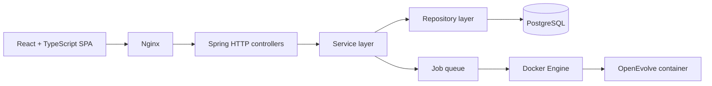

# EvoLab-as-a-Service

> **A Web Platform for Automated Algorithm Optimization using LLM-Driven Evolution**

**Academic Project G30 · Final grade: 18/20**

EvoLab-as-a-Service is a full-stack platform for configuring, running, and monitoring automated program-evolution experiments. It provides a web interface around [OpenEvolve](https://github.com/algorithmicsuperintelligence/openevolve), allowing users to combine an initial program, an evaluator, and an LLM-backed evolution configuration without managing each experiment manually.

## Overview

The platform manages the complete experiment lifecycle:

1. Register locally or sign in with Google.
2. Configure credentials for OpenAI, Gemini, Anthropic, or a compatible local model.
3. Define the model and evolutionary parameters used by OpenEvolve.
4. Create a project with an initial program and evaluator code.
5. Start or restart an isolated Docker-based evolution job.
6. Follow job status, fitness metrics, checkpoints, and the best solution found.

API credentials are encrypted before they are persisted. Evolution jobs run through a backend worker queue and use the official OpenEvolve container image.

## Key features

- Local username/password authentication and Google OAuth 2.0 login.
- Encrypted credential management for OpenAI, Gemini, Anthropic, and local models.
- Reusable OpenEvolve configurations with model, prompt, population, evaluator, and evolution settings.
- Project creation from pasted or uploaded initial-program and evaluator files.
- Queued Docker execution with project start and restart flows.
- Experiment history with per-iteration fitness metrics and saved checkpoints.
- User profile statistics and project-readiness validation.
- Responsive React interface backed by a layered Kotlin/Spring API.

## Architecture



The backend is split into focused Gradle modules:

- `domain` — framework-independent entities and value types.
- `repo` — JDBI repositories and PostgreSQL persistence.
- `service` — business rules, configuration generation, and job orchestration.
- `http` — REST controllers and HTTP models.
- `app` — Spring Boot entry point, dependency wiring, authentication, and security.
- `db` — PostgreSQL image and schema initialization.

Controllers call services, services call repositories, and database access stays inside the repository layer.

## Technology stack

| Area | Technologies |
| --- | --- |
| Frontend | React 19, TypeScript, Vite, React Router, Framer Motion |
| Backend | Kotlin 2.2, Spring Boot 4, Java 21 |
| Persistence | PostgreSQL 16, JDBI 3 |
| Experiment execution | Docker, OpenEvolve |
| Delivery | Docker Compose, Nginx, Certbot |
| Testing | JUnit 5, Kotlin Test, Vitest, Testing Library, Playwright |

## Prerequisites

For the Docker Compose setup:

- Git
- Docker Engine with Docker Compose
- Java 21 (the backend JAR is built on the host with the included Gradle wrapper)

For component-level development, also install Node.js 20.19+ or 22.12+ and npm, matching Vite's declared runtime requirement.

## Quick start with Docker Compose

Clone the repository and enter its root directory:

```bash
git clone https://github.com/Projeto-Final-Leic-2026-Andre-Miguel/EvoLabAsAService.git
cd EvoLabAsAService
```

Create an untracked `.env` file:

```dotenv
POSTGRES_PASSWORD=replace-with-a-strong-password
GOOGLE_CLIENT_ID=replace-with-your-google-client-id
GOOGLE_CLIENT_SECRET=replace-with-your-google-client-secret
ENCRYPTION_SECRET_KEY=replace-with-a-base64-encoded-32-byte-key
```

`ENCRYPTION_SECRET_KEY` must be a Base64-encoded 256-bit key. One can be generated with:

```bash
openssl rand -base64 32
```

Build the backend JAR and start the local Compose stack:

```bash
./gradlew :evolab-backend:app:bootJar
docker compose -f docker-compose.yml -f docker-compose.local.yml up --build
```

On Windows, replace `./gradlew` with `.\gradlew.bat`.

Open [http://localhost:8080](http://localhost:8080). The local Nginx configuration serves the frontend and proxies API and OAuth requests to the backend inside the Compose networks.

Stop the stack with:

```bash
docker compose -f docker-compose.yml -f docker-compose.local.yml down
```

> [!WARNING]
> The backend mounts the Docker socket to create OpenEvolve containers. Access to the deployment host and application must therefore be restricted appropriately; do not expose an untrusted instance without reviewing this security boundary.

## Local development

### 1. Start PostgreSQL

Build the repository's schema-initializing database image and publish PostgreSQL on port 5432:

```bash
docker build -t evolab-postgres ./evolab-backend/db
docker run --name evolab-db-dev --rm -d \
  -p 5432:5432 \
  -e POSTGRES_DB=evolab \
  -e POSTGRES_USER=evolabuser \
  -e POSTGRES_PASSWORD=replace-with-your-password \
  evolab-postgres
```

### 2. Run the backend

```bash
export DB_URL="jdbc:postgresql://localhost:5432/evolab?user=evolabuser&password=replace-with-your-password"
export GOOGLE_CLIENT_ID="replace-with-your-google-client-id"
export GOOGLE_CLIENT_SECRET="replace-with-your-google-client-secret"
export ENCRYPTION_SECRET_KEY="replace-with-a-base64-encoded-32-byte-key"
./gradlew :evolab-backend:app:bootRun
```

PowerShell equivalent:

```powershell
$env:DB_URL="jdbc:postgresql://localhost:5432/evolab?user=evolabuser&password=replace-with-your-password"
$env:GOOGLE_CLIENT_ID="replace-with-your-google-client-id"
$env:GOOGLE_CLIENT_SECRET="replace-with-your-google-client-secret"
$env:ENCRYPTION_SECRET_KEY="replace-with-a-base64-encoded-32-byte-key"
.\gradlew.bat :evolab-backend:app:bootRun
```

The backend listens on `http://localhost:8080`.

### 3. Run the frontend

In a second terminal:

```bash
cd evolab-frontend/EvoLabAsAService
npm install
npm run dev
```

Vite prints the frontend URL, normally `http://localhost:5173`, and proxies `/api`, `/oauth2`, and `/login/oauth2` to the backend on port 8080.

## Environment variables

| Variable | Required | Purpose |
| --- | --- | --- |
| `DB_URL` | Backend outside Compose | JDBC URL used by the Kotlin application |
| `POSTGRES_PASSWORD` | Docker Compose | Password used by PostgreSQL and the Compose-generated JDBC URL |
| `GOOGLE_CLIENT_ID` | Yes | Google OAuth 2.0 client identifier |
| `GOOGLE_CLIENT_SECRET` | Yes | Google OAuth 2.0 client secret |
| `ENCRYPTION_SECRET_KEY` | Yes | Base64-encoded 32-byte AES-256 key used to encrypt stored LLM credentials |
| `DOCKER_HOST` | Optional | Overrides the Docker daemon endpoint used for experiment execution |

Never commit `.env` files, API keys, OAuth secrets, or encryption keys.

## Testing

Run all backend tests from the repository root:

```bash
./gradlew test
```

Run the frontend unit and component tests:

```bash
cd evolab-frontend/EvoLabAsAService
npm test -- --run
```

Run the Playwright end-to-end suite:

```bash
npm run test:e2e
```

Build and lint the frontend with:

```bash
npm run build
npm run lint
```

## Repository structure

```text
.
├── evolab-backend/
│   ├── app/                 # Spring Boot application and wiring
│   ├── db/                  # PostgreSQL image and SQL initialization
│   ├── domain/              # Domain entities and types
│   ├── http/                # REST controllers and HTTP models
│   ├── repo/                # PostgreSQL repositories
│   └── service/             # Business logic and job execution
├── evolab-frontend/
│   └── EvoLabAsAService/    # React application and frontend tests
├── docs/                    # Project documentation
├── docker-compose.yml       # Deployment-oriented stack
├── docker-compose.local.yml # Local HTTP override
└── settings.gradle.kts      # Gradle module definition
```

## Academic context

**Project G30 — EvoLab-as-a-Service: A Web Platform for Automated Algorithm Optimization using LLM-Driven Evolution**

### Students

- **51557 — Miguel Morais Pinto**
- **51585 — André Filipe de Sousa Vaz**

### Jury

- José Simão
- Filipe Freitas
- F. Sousa

### Result

The project received a final grade of **18/20**.

## Acknowledgements

EvoLab-as-a-Service integrates [OpenEvolve](https://github.com/algorithmicsuperintelligence/openevolve), an open-source evolutionary coding agent, and is built on the work of the Kotlin, Spring, React, PostgreSQL, Docker, and broader open-source communities.
